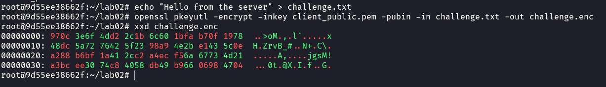

# IS-Lab02-02FIE-22110065
# Task 1: Public-key based authentication 
**Question 1**: 
Implement public-key based authentication step-by-step with openssl according the following scheme.


**Answer 1**:

## Step 1: Preparing the environment
### 1.1. Create docker VMs
I have created 2 docker container named userver and uclient.


### 1.2. Install nessesary packages
Then, on both machine, install the nessesary packages:

Using this command: `apt update && apt install openssl netcat-traditional net-tools xxd`


1. `openssl`: To use openssl
2. `netcat` (traditional): To send and receive files, specifically the public key.
3. `net-tools`: To use the command `ifconfig` to see the IP address of the machine.
4. `xxd`: To inspect hex values from binary files


## Step 2: Create client's private and public keys
### 2.1. Create private key

I used RSA to encrypt the private key, with the length of 512 bits for faster computational speed, but unrealistic in real life usage.

Command: `openssl genrsa -out client_private.pem 512`

Explain the command:

- `genrsa`: Generate RSA private key.
- `client_private.pem`: The file name to save the private key in.
- `512`: The length of the private key.

The private key is saved in file named `client_private.pem`


### 2.2. Create public key

From the private key, we can generate the public key using the following command:

```
openssl rsa -in client_private.pem -pubout -out client_public.pem
```

The above command uses the `client_private.pem` as input, and extract a public key from the private key (`-pubout`) and save the public key to `client_public.pem` (`-out client_public.pem`)


### 2.3. Send public key to server machine

In order to send the public key `client_public.pem` to the server machine, we use `netcat`.

First, on the server, we have to know the IP address of the machine:


First, the server have to be listening on a port (I used port 4444) using the command 

```
nc -lv -p 4444 > client_public.pem
```


The server machine will be listening (`-l`) on port 4444 (`-p 4444`), and will print out the log (`-v`). The receive bits will be saved into `client_public.pem` on the server machine.

Then, the client can send the file using
```
nc [ip address] 4444 < client_public.pem
```
The client machine will send the file `client_public.pem` to the server's IP address, port 4444


Now, the client_public is now on the server machine


We can see that the public key is the same on both machine. The public key is sent successfully.

## Step 3: Encrypt the message

First, create a `challenge.txt` file
```
echo "Hello from the server" > challenge.txt
```

And encrypt the message using the following command
```
openssl pkeyutl -encrypt -inkey client_public.pem -pubin -in challenge.txt -out challenge.enc
```

The command will use RSA to encrypt the file `challenge.txt` using the public key from `client_public.pem`. The result will be saved in `challenge.enc`.



## Step 4: Send the encrypted message to the client.

The server will send the encrypted message to the client's address, which also changed half-way during the lab.

First, the client must be listening on port 4445, then the server can send the file.


The client now have the encrypted challenge file:


## Step 4: Decrypt the challenge

Using the decrypt command:
```
openssl pkeyutl -decrypt -inkey client_private.pem -in challenge.enc -out decrypted_challenge.txt
```

The command is used to decrypt the encrypted `challenge.enc` using the client's private key (`-inkey client_private.pem`), and save the decrypted to `decrypted_challenge.txt`.
 


## Step 5: Sign the challenge using client's private key

I will use -sha256 to create the signature to sign using client's private key. The result is saved to `signed_challenge.bin`.
```
openssl dgst -sha256 -sign client_private.pem -out signed_challenge.bin decrypted_challenge.txt
```

## Step 6: Send the signature back to the server


## Step 7: Verify the signature

```
openssl dgst -sha256 -verify client_public.pem -signature signed_challenge.bin challenge.txt
```

Explain the command:

- `-sha256`: Use SHA-256 for hashing.
- `-verify client_public.pem`: Verify the signature using the public key in client_public.pem.
- `-signature signed_challenge.bin`: Specifies the received `signed_challenge.bin` as the signature file to check.
- `challenge.txt`: The file to verify.


The file is now verifed.

**Conclusion:** I have successfully implemented public-key based authentication step-by-step with `openssl`.


